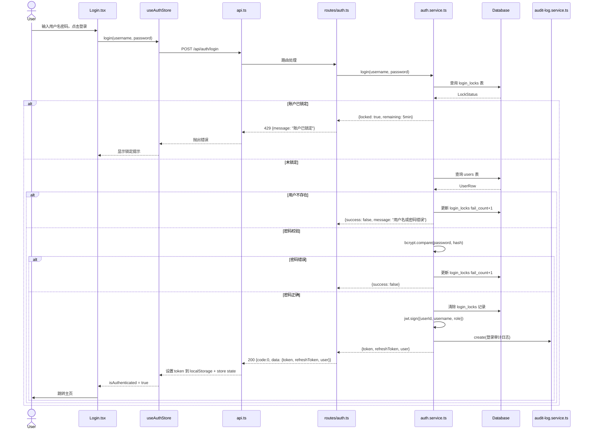
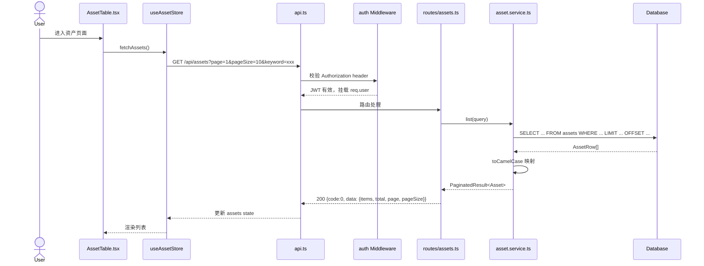
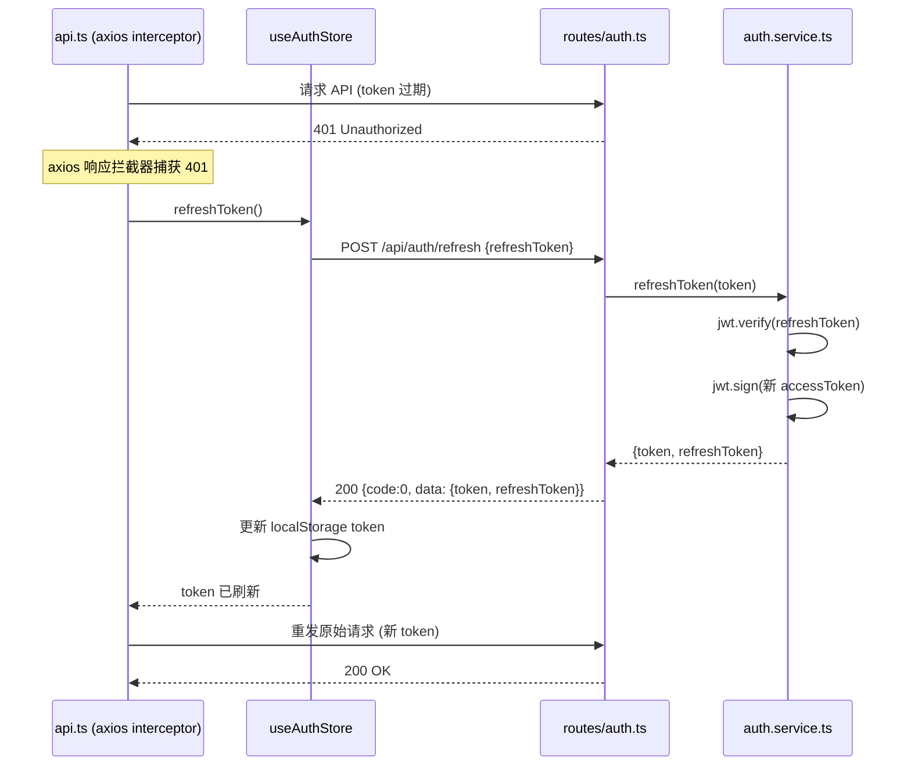
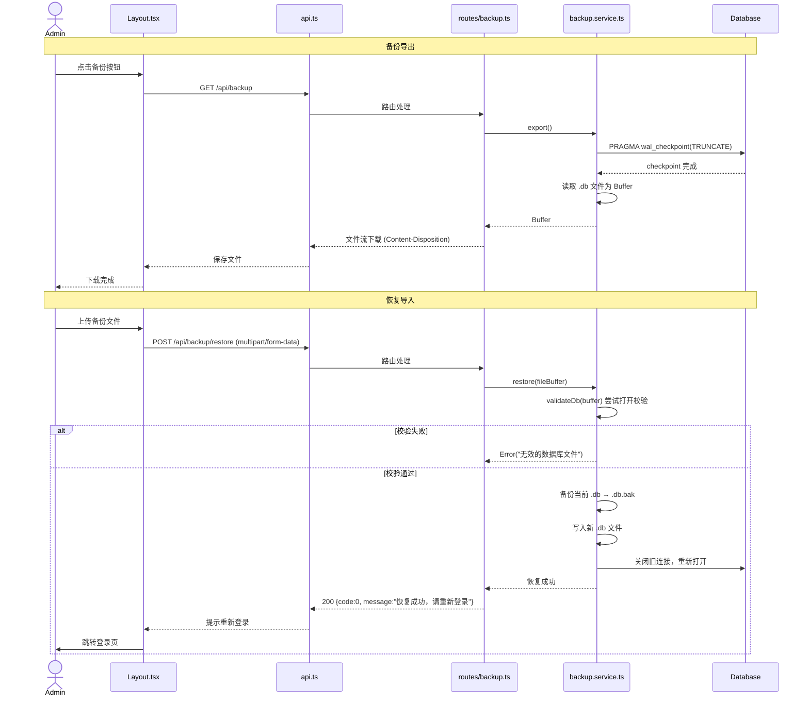
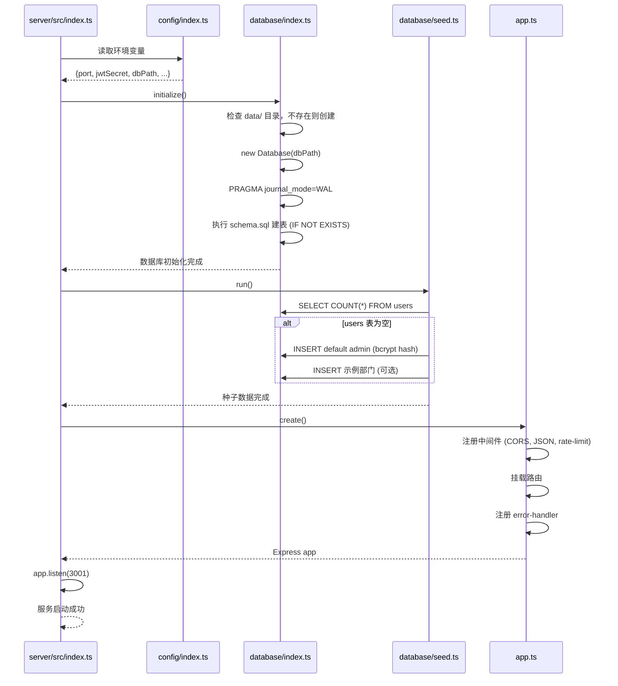
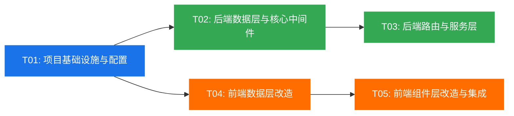

# 系统架构设计：企业设备资产管理系统生产化改造

> 版本：v2.0 | 架构师：高见远（Bob） | 日期：2026-05-19

---

## Part A：系统设计

### 1. 实现方案

#### 1.1 核心技术挑战

| 挑战 | 说明 | 解决方案 |
|------|------|----------|
| 前后端数据层解耦 | 现有4个 Zustand store 深度依赖 localStorage persist，需完全重构为 API 驱动 | 保留 Zustand 作为状态容器，移除 persist 中间件，store 动作改为调用 API 并更新内存状态 |
| 命名规范转换 | 数据库 snake_case ↔ 前端 camelCase | service 层统一做 `toCamelCase` / `toSnakeCase` 映射，route 层和前端只接触 camelCase |
| 认证体系从零构建 | 原系统用 btoa 可逆编码，无 token 机制 | 后端 JWT 签发 + bcrypt 密码哈希 + 中间件鉴权，前端 axios 拦截器自动携带/刷新 token |
| 备份恢复的数据一致性 | SQLite WAL 模式下备份需 checkpoint | 备份前执行 `PRAGMA wal_checkpoint(TRUNCATE)`，恢复时校验文件合法性后替换 |
| 前端组件层适配 | 组件直接读写 store，需改为异步 API 调用 | store 动作改为 async，组件调用时加 loading/error 状态 |

#### 1.2 架构模式

采用 **前后端分离 + 分层架构**：

```
┌─────────────────────────────────────────────────────┐
│                     前端 (React SPA)                  │
│  Components → Zustand Store → API Client (axios)     │
└────────────────────────┬────────────────────────────┘
                         │ HTTP / JWT Bearer
┌────────────────────────▼────────────────────────────┐
│                     后端 (Express)                    │
│  Routes → Services → Database (better-sqlite3)       │
│  Middleware: Auth / Role / RateLimit / Error          │
└─────────────────────────────────────────────────────┘
                         │
                    SQLite (.db)
```

- **后端三层架构**：Routes（参数校验+HTTP协议）→ Services（业务逻辑+数据映射）→ Database（SQL执行）
- **前端数据流**：Component → Store async action → API Client → 后端 → 更新 store state → 组件重渲染
- **认证流**：JWT 无状态认证，Access Token 2h + Refresh Token 7d

#### 1.3 框架选型与依赖

| 类别 | 选型 | 理由 |
|------|------|------|
| 后端框架 | Express 4 | 生态成熟，轻量，适合中小系统 |
| 数据库驱动 | better-sqlite3 | 同步 API，性能优于 sqlite3，WAL 模式支持好 |
| 密码哈希 | bcryptjs | 纯 JS 实现，无需编译原生模块，跨平台部署简单 |
| JWT | jsonwebtoken | Node.js 生态标准 JWT 库 |
| 请求限流 | express-rate-limit | Express 官方推荐限流中间件 |
| 文件上传 | multer | 备份恢复文件上传 |
| CORS | cors | Express 标准 CORS 中间件 |
| 前端 HTTP | axios | 拦截器机制完善，适合统一 token 管理和错误处理 |
| 参数校验 | 后端手动校验 | 项目规模小，不引入 zod/joi 避免额外依赖 |

---

### 2. 文件列表

#### 2.1 后端新增文件（server/ 目录）

| 相对路径 | 说明 |
|----------|------|
| `server/package.json` | 后端依赖声明与脚本 |
| `server/tsconfig.json` | TypeScript 配置 |
| `server/src/index.ts` | 入口文件：启动 HTTP 服务 |
| `server/src/app.ts` | Express 应用配置：中间件注册、路由挂载 |
| `server/src/config/index.ts` | 配置管理：环境变量读取与默认值 |
| `server/src/types/index.ts` | 后端类型定义：DB 行类型、JWT Payload 等 |
| `server/src/database/index.ts` | 数据库连接、初始化、WAL 模式配置 |
| `server/src/database/schema.sql` | 建表 SQL（8 张表） |
| `server/src/database/seed.ts` | 种子数据：默认 admin 账号、示例数据 |
| `server/src/utils/response.ts` | 统一响应工具：success / error / paginate |
| `server/src/utils/mapper.ts` | snake_case ↔ camelCase 字段映射 |
| `server/src/utils/password.ts` | bcrypt 密码哈希与校验 |
| `server/src/middleware/auth.ts` | JWT 认证中间件 |
| `server/src/middleware/role.ts` | 角色鉴权中间件 |
| `server/src/middleware/error-handler.ts` | 全局错误处理中间件 |
| `server/src/middleware/rate-limit.ts` | 请求限流配置 |
| `server/src/services/auth.service.ts` | 认证服务：登录/登出/刷新/修改密码/锁定逻辑 |
| `server/src/services/asset.service.ts` | 资产服务：CRUD/批量删除/导入/导出/编号生成 |
| `server/src/services/department.service.ts` | 部门服务：CRUD |
| `server/src/services/inventory.service.ts` | 盘点服务：任务CRUD/记录更新 |
| `server/src/services/change-log.service.ts` | 变动记录服务：查询/新增 |
| `server/src/services/user.service.ts` | 用户管理服务：CRUD/重置密码 |
| `server/src/services/dashboard.service.ts` | 看板服务：统计数据聚合 |
| `server/src/services/backup.service.ts` | 备份恢复服务：导出/导入/校验 |
| `server/src/services/audit-log.service.ts` | 审计日志服务：查询/记录 |
| `server/src/routes/auth.ts` | 认证路由 |
| `server/src/routes/assets.ts` | 资产路由 |
| `server/src/routes/departments.ts` | 部门路由 |
| `server/src/routes/inventory.ts` | 盘点路由 |
| `server/src/routes/change-logs.ts` | 变动记录路由 |
| `server/src/routes/users.ts` | 用户管理路由 |
| `server/src/routes/dashboard.ts` | 看板路由 |
| `server/src/routes/backup.ts` | 备份恢复路由 |
| `server/src/routes/audit-logs.ts` | 审计日志路由 |
| `server/src/routes/health.ts` | 健康检查路由 |

#### 2.2 前端修改/新增文件

| 相对路径 | 操作 | 说明 |
|----------|------|------|
| `vite.config.ts` | 修改 | 添加 API 代理 `/api` → `http://localhost:3001` |
| `package.json` | 修改 | 新增 axios 依赖 |
| `src/services/api.ts` | 新增 | Axios 实例：baseURL、请求/响应拦截器、token 管理 |
| `src/store/useAuthStore.ts` | 重写 | 移除 persist，改为 API 调用 + token 管理 |
| `src/store/useAssetStore.ts` | 重写 | 移除 persist，改为 API 调用 + 内存缓存 |
| `src/store/useDeptStore.ts` | 重写 | 移除 persist，改为 API 调用 + 内存缓存 |
| `src/store/useInventoryStore.ts` | 重写 | 移除 persist，改为 API 调用 + 内存缓存 |
| `src/types/index.ts` | 修改 | 新增 API 响应类型、移除密码相关类型注释 |
| `src/utils/auth.ts` | 重写 | 从 btoa 编码改为 JWT token 存取工具 |
| `src/components/Login.tsx` | 修改 | 调用 API 登录、存储 token |
| `src/components/Layout.tsx` | 修改 | 移除 initSampleData 逻辑、新增密码修改入口 |
| `src/components/UserManagement.tsx` | 修改 | 改为调用 API |
| `src/components/Dashboard.tsx` | 修改 | 数据从 API 获取 |
| `src/components/AssetTable.tsx` | 修改 | 适配异步 store |
| `src/App.tsx` | 修改 | Token 刷新逻辑、全局错误处理 |
| `src/components/ChangePasswordDialog.tsx` | 新增 | 密码修改对话框（用户自改+管理员重置） |

---

### 3. 数据结构与接口

#### 3.1 类图

```mermaid
classDiagram
    direction TB

    class Database {
        -db: Database
        +getInstance() Database
        +initialize() void
        +close() void
    }

    class AuthService {
        +login(username, password) LoginResult
        +logout(userId) void
        +refreshToken(refreshToken) TokenPair
        +changePassword(userId, oldPwd, newPwd) void
        +checkLock(username) LockStatus
        +recordFail(username) void
        +clearLock(username) void
    }

    class AssetService {
        +list(query: AssetQuery) PaginatedResult~Asset~
        +getById(id) Asset
        +create(data: AssetFormData) Asset
        +update(id, data: AssetFormData) Asset
        +delete(id) void
        +batchDelete(ids) void
        +import(dataList) ImportResult
        +generateAssetCode() string
    }

    class DepartmentService {
        +list() Department[]
        +create(name) Department
        +update(id, name) Department
        +delete(id) void
    }

    class InventoryService {
        +listTasks() InventoryTask[]
        +createTask(data) InventoryTask
        +updateRecord(taskId, recordId, status, remark) InventoryRecord
    }

    class ChangeLogService {
        +list(query) ChangeLog[]
        +create(log) ChangeLog
    }

    class UserService {
        +list() User[]
        +create(data) User
        +update(id, data) User
        +delete(id) void
        +resetPassword(id, newPwd) void
    }

    class DashboardService {
        +getStats() DashboardStats
    }

    class BackupService {
        +export() Buffer
        +restore(fileBuffer) void
        +validateDb(buffer) boolean
    }

    class AuditLogService {
        +list(query) PaginatedResult~AuditLog~
        +create(log) void
    }

    class AuthMiddleware {
        +authenticate(req, res, next) void
    }

    class RoleMiddleware {
        +authorize(roles: Role[]) Middleware
    }

    class ApiClient {
        -instance: AxiosInstance
        +get~T~(url, params) ApiResponse~T~
        +post~T~(url, data) ApiResponse~T~
        +put~T~(url, data) ApiResponse~T~
        +delete~T~(url) ApiResponse~T~
        +setToken(token) void
        +clearToken() void
    }

    class UseAuthStore {
        +currentUser: User | null
        +token: string | null
        +refreshToken: string | null
        +isAuthenticated: boolean
        +loading: boolean
        +login(username, password) Promise~void~
        +logout() Promise~void~
        +refreshAccessToken() Promise~void~
        +changePassword(oldPwd, newPwd) Promise~void~
        +hasPermission(action) boolean
    }

    class UseAssetStore {
        +assets: Asset[]
        +changeLogs: ChangeLog[]
        +loading: boolean
        +fetchAssets() Promise~void~
        +addAsset(data) Promise~void~
        +updateAsset(id, data) Promise~void~
        +deleteAsset(id) Promise~void~
        +batchDeleteAssets(ids) Promise~void~
        +importAssets(dataList) Promise~void~
        +fetchChangeLogs() Promise~void~
    }

    class UseDeptStore {
        +departments: Department[]
        +loading: boolean
        +fetchDepartments() Promise~void~
        +addDept(name) Promise~void~
        +updateDept(id, name) Promise~void~
        +deleteDept(id) Promise~void~
    }

    class UseInventoryStore {
        +tasks: InventoryTask[]
        +loading: boolean
        +fetchTasks() Promise~void~
        +addTask(data) Promise~void~
        +updateRecordStatus(taskId, recordId, status, remark) Promise~void~
    }

    Database --> AuthService : uses
    Database --> AssetService : uses
    Database --> DepartmentService : uses
    Database --> InventoryService : uses
    Database --> ChangeLogService : uses
    Database --> UserService : uses
    Database --> DashboardService : uses
    Database --> BackupService : uses
    Database --> AuditLogService : uses

    AuthService --> AuditLogService : records
    AssetService --> ChangeLogService : records
    AssetService --> AuditLogService : records
    DepartmentService --> AuditLogService : records
    UserService --> AuditLogService : records
    BackupService --> AuditLogService : records

    UseAuthStore --> ApiClient : calls
    UseAssetStore --> ApiClient : calls
    UseDeptStore --> ApiClient : calls
    UseInventoryStore --> ApiClient : calls
```



#### 3.2 核心数据类型

**后端 DB 行类型**（snake_case，与数据库列名一致）：

```typescript
// server/src/types/index.ts

/** DB 行类型 — snake_case */
interface UserRow {
  id: string;
  username: string;
  password: string;        // bcrypt hash
  real_name: string;
  role: string;            // 'super_admin' | 'admin' | 'user'
  status: string;          // 'active' | 'disabled'
  created_at: string;
  updated_at: string;
}

interface AssetRow {
  id: string;
  asset_code: string;
  name: string;
  type: string;
  model: string;
  department: string;
  user: string;
  purchase_date: string;
  status: string;
  location: string;
  remark: string;
  created_at: string;
  updated_at: string;
}

interface DepartmentRow {
  id: string;
  name: string;
  created_at: string;
}

interface InventoryTaskRow {
  id: string;
  name: string;
  department: string;
  created_at: string;
}

interface InventoryRecordRow {
  id: string;
  task_id: string;
  asset_id: string;
  asset_code: string;
  asset_name: string;
  status: string;
  remark: string;
  checked_at: string;
}

interface ChangeLogRow {
  id: string;
  asset_code: string;
  asset_name: string;
  action: string;
  detail: string;
  timestamp: string;
}

interface AuditLogRow {
  id: string;
  user_id: string;
  username: string;
  action: string;
  resource: string;
  detail: string;
  ip: string;
  timestamp: string;
}

interface LoginLockRow {
  id: string;
  username: string;
  fail_count: number;
  locked_until: string | null;
  updated_at: string;
}

/** JWT Payload */
interface JwtPayload {
  userId: string;
  username: string;
  role: string;
}

/** 统一 API 响应 */
interface ApiResponse<T = any> {
  code: number;
  message: string;
  data: T;
}

/** 分页结果 */
interface PaginatedResult<T> {
  items: T[];
  total: number;
  page: number;
  pageSize: number;
}
```

**前端新增类型**（camelCase，与现有类型对齐）：

```typescript
// src/types/index.ts 新增部分

/** API 统一响应 */
export interface ApiResponse<T = any> {
  code: number;
  message: string;
  data: T;
}

/** 分页响应 */
export interface PaginatedData<T> {
  items: T[];
  total: number;
  page: number;
  pageSize: number;
}

/** 登录响应 */
export interface LoginResponse {
  token: string;
  refreshToken: string;
  user: User;
}

/** 看板统计 */
export interface DashboardStats {
  totalCount: number;
  inUseCount: number;
  idleCount: number;
  repairCount: number;
  scrappedCount: number;
  typeDistribution: { name: string; value: number }[];
  deptDistribution: { name: string; count: number }[];
  recentChangeLogs: ChangeLog[];
}

/** 审计日志 */
export interface AuditLog {
  id: string;
  userId: string;
  username: string;
  action: string;
  resource: string;
  detail: string;
  ip: string;
  timestamp: string;
}
```

---

### 4. 程序调用流程

#### 4.1 登录认证时序



#### 4.2 资产列表查询时序



#### 4.3 Token 刷新时序



#### 4.4 备份恢复时序



#### 4.5 应用启动初始化时序



---

### 5. 待明确事项

| 编号 | 事项 | 当前假设 | 影响范围 |
|------|------|----------|----------|
| A1 | `assets.user` 列在 SQL 中 `user` 是保留字 | 数据库列名使用 `user` 并加引号，前端不变 | schema.sql, mapper |
| A2 | Refresh Token 是否持久化到数据库 | 不持久化，仅使用 JWT 自身校验（无状态），7天有效期 | auth.service |
| A3 | 审计日志 UI 入口位置 | 在 Layout 侧边栏添加「审计日志」导航项，仅 super_admin 可见 | Layout.tsx, App.tsx |
| A4 | 备份恢复 UI 入口位置 | 在 Layout 侧边栏添加「系统设置」导航项，包含备份/恢复/审计日志 | Layout.tsx |
| A5 | 数据库 ID 生成策略 | 继续使用前端 `generateId()` 的格式：`Date.now()-randomStr`，由后端 service 层生成 | 各 service 文件 |
| A6 | 资产导出接口 GET /api/assets/export | 返回 JSON 数据，前端继续用 xlsx 库生成 Excel 文件（保持现有逻辑） | asset.service, ImportExport.tsx |
| A7 | 变动记录 `timestamp` 字段 | 数据库列名保持 `timestamp`（与 PRD schema 一致），不改为 `created_at` | schema.sql, mapper |
| A8 | `InventoryRecord` 中 `taskName` 和 `department` 字段 | 数据库不存储（通过 JOIN 获取），API 返回时从 task 关联填充 | inventory.service |

---

## Part B：任务分解

### 6. 所需包

#### 后端新增依赖（server/package.json）

```
- express@^4.18.2: Web 框架
- better-sqlite3@^11.0.0: SQLite 数据库驱动（同步API）
- bcryptjs@^2.4.3: 密码哈希（纯JS实现）
- jsonwebtoken@^9.0.2: JWT 签发与校验
- cors@^2.8.5: CORS 中间件
- express-rate-limit@^7.1.5: 请求限流
- multer@^1.4.5-lts.1: 文件上传（备份恢复）
- dotenv@^16.3.1: 环境变量管理
- dayjs@^1.11.10: 日期格式化
- uuid@^9.0.0: ID 生成（备选）
```

#### 后端开发依赖（server/package.json devDependencies）

```
- typescript@^5.3.3: TypeScript 编译
- @types/express@^4.17.21: Express 类型
- @types/better-sqlite3@^7.6.8: better-sqlite3 类型
- @types/bcryptjs@^2.4.6: bcryptjs 类型
- @types/jsonwebtoken@^9.0.5: jsonwebtoken 类型
- @types/cors@^2.8.17: cors 类型
- @types/multer@^1.4.11: multer 类型
- @types/uuid@^9.0.7: uuid 类型
- tsx@^4.7.0: TypeScript 执行器（开发时 tsx server/src/index.ts）
```

#### 前端新增依赖

```
- axios@^1.6.2: HTTP 请求客户端
```

---

### 7. 任务列表

#### T01：项目基础设施与配置

**任务说明**：搭建后端项目骨架、配置文件、入口文件，以及前端开发代理配置和 API 客户端。这是所有后续任务的前置基础。

**源文件**：
- `server/package.json` — 后端依赖声明与脚本
- `server/tsconfig.json` — 后端 TypeScript 配置
- `server/src/index.ts` — 后端入口：加载配置→初始化数据库→启动服务
- `server/src/app.ts` — Express 应用：中间件注册、路由挂载、错误处理
- `server/src/config/index.ts` — 环境变量读取与默认值（PORT/JWT_SECRET/DB_PATH 等）
- `vite.config.ts` — 添加 `/api` 代理到 `http://localhost:3001`
- `package.json` — 前端新增 axios 依赖
- `src/services/api.ts` — Axios 实例：baseURL、请求拦截器（添加 Bearer token）、响应拦截器（401 跳登录、刷新 token、统一错误提示）

**依赖**：无

**优先级**：P0

**实现要点**：
1. `server/package.json` 的 `scripts` 配置 `"dev": "tsx watch server/src/index.ts"` 和 `"start": "tsx server/src/index.ts"`
2. `server/tsconfig.json` 的 `module` 设为 `ESNext`，`moduleResolution` 设为 `bundler`，`outDir` 设为 `./dist`
3. `app.ts` 中间件注册顺序：cors → express.json() → rate-limit → 路由 → error-handler
4. `api.ts` 中 `baseURL` 设为 `/api`，利用 vite proxy；生产环境可通过环境变量覆盖
5. 请求拦截器：从 `localStorage` 读取 token 附加到 `Authorization: Bearer <token>`
6. 响应拦截器：捕获 401 → 尝试刷新 token → 刷新失败则清除 token 跳转登录页
7. `config/index.ts` 从 `process.env` 读取，提供默认值：PORT=3001, JWT_SECRET=dev-secret-key, DB_PATH=./data/asset-manager.db

---

#### T02：后端数据层与核心中间件

**任务说明**：实现数据库初始化与建表、种子数据、统一响应格式、字段映射工具、密码工具、JWT 认证/角色中间件、限流中间件、全局错误处理。这是所有后端业务逻辑的基础。

**源文件**：
- `server/src/types/index.ts` — 后端类型定义：DB Row 类型、JwtPayload、ApiResponse 等
- `server/src/database/index.ts` — 数据库连接管理：单例模式、WAL 模式、自动建表
- `server/src/database/schema.sql` — 8 张表建表 SQL（users, departments, assets, inventory_tasks, inventory_records, change_logs, audit_logs, login_locks）
- `server/src/database/seed.ts` — 种子数据：默认 admin 账号(bcrypt)、示例部门
- `server/src/utils/response.ts` — 统一响应：`success(data)`, `error(code, msg)`, `paginate(items, total, page, pageSize)`
- `server/src/utils/mapper.ts` — `toCamelCase(row)` 和 `toSnakeCase(obj)` 字段映射函数
- `server/src/utils/password.ts` — `hashPassword(pwd)` 和 `verifyPassword(pwd, hash)`，bcryptjs saltRounds=10
- `server/src/middleware/auth.ts` — `authMiddleware`：从 Authorization header 解析 JWT，挂载 `req.user = {userId, username, role}`
- `server/src/middleware/role.ts` — `roleMiddleware(roles[])`：检查 `req.user.role` 是否在允许列表
- `server/src/middleware/error-handler.ts` — 全局错误处理：捕获异常，返回统一格式 `{code, message}`
- `server/src/middleware/rate-limit.ts` — 限流配置：登录接口 5次/分钟、通用接口 100次/分钟

**依赖**：T01

**优先级**：P0

**实现要点**：
1. `database/index.ts` 使用 `better-sqlite3`，启用 WAL 模式 `db.pragma('journal_mode = WAL')`
2. `schema.sql` 使用 `CREATE TABLE IF NOT EXISTS`，避免重复建表
3. `seed.ts` 检测 `users` 表是否为空，为空则插入默认 admin：`{username:'admin', password: bcrypt('admin123'), real_name:'系统管理员', role:'super_admin'}`
4. `mapper.ts` 的 `toCamelCase` 函数处理关键映射：`real_name→realName`, `asset_code→assetCode`, `purchase_date→purchaseDate`, `created_at→createdAt`, `updated_at→updatedAt`, `fail_count→failCount`, `locked_until→lockedUntil`, `user_id→userId`, `task_id→taskId`, `asset_id→assetId`, `checked_at→checkedAt`
5. `authMiddleware` 逻辑：提取 Bearer token → `jwt.verify` → 解出 payload → `req.user = payload` → `next()`
6. `roleMiddleware` 返回中间件函数，比较 `req.user.role` 与允许列表
7. 登录接口不加 `authMiddleware`，其他所有接口加 `authMiddleware`
8. `error-handler` 需处理 `JsonWebTokenError`、`TokenExpiredError`、自定义业务错误等
9. `rate-limit.ts` 导出两个限流器：`loginLimiter`（5次/分钟/IP）和 `apiLimiter`（100次/分钟/IP）

---

#### T03：后端路由与服务层

**任务说明**：实现全部 10 个模块的 API 端点（认证、资产、部门、盘点、变动记录、用户管理、看板、备份恢复、审计日志、健康检查）。每个模块包含 route 文件（HTTP协议层）和 service 文件（业务逻辑层）。

**源文件**：
- `server/src/routes/auth.ts` — 认证路由：POST /login, POST /logout, POST /refresh, PUT /password
- `server/src/services/auth.service.ts` — 认证业务逻辑：登录校验+bcrypt+JWT签发、锁定逻辑、token刷新、密码修改
- `server/src/routes/assets.ts` — 资产路由：GET(list/detail), POST, PUT, DELETE, POST /batch-delete, POST /import
- `server/src/services/asset.service.ts` — 资产业务逻辑：分页查询+筛选+排序、CRUD、编号生成、导入、变动记录自动创建
- `server/src/routes/departments.ts` — 部门路由：GET, POST, PUT, DELETE
- `server/src/services/department.service.ts` — 部门业务逻辑：CRUD、删除时清空资产部门归属
- `server/src/routes/inventory.ts` — 盘点路由：GET /tasks, POST /tasks, PUT /tasks/:id/records/:recordId
- `server/src/services/inventory.service.ts` — 盘点业务逻辑：任务CRUD（含关联records查询）、记录更新
- `server/src/routes/change-logs.ts` — 变动记录路由：GET
- `server/src/services/change-log.service.ts` — 变动记录业务逻辑：查询+新增
- `server/src/routes/users.ts` — 用户路由：GET, POST, PUT, DELETE, PUT /:id/reset-password
- `server/src/services/user.service.ts` — 用户业务逻辑：CRUD、重置密码、用户名唯一校验
- `server/src/routes/dashboard.ts` — 看板路由：GET /stats
- `server/src/services/dashboard.service.ts` — 看板业务逻辑：聚合查询（状态统计、类型分布、部门分布、近期变动）
- `server/src/routes/backup.ts` — 备份路由：GET /backup, POST /backup/restore
- `server/src/services/backup.service.ts` — 备份业务逻辑：WAL checkpoint → 读取文件 → 下载；校验 → 备份当前文件 → 写入新文件 → 重新连接
- `server/src/routes/audit-logs.ts` — 审计日志路由：GET
- `server/src/services/audit-log.service.ts` — 审计日志业务逻辑：查询+记录（被其他 service 调用）
- `server/src/routes/health.ts` — 健康检查路由：GET /health（无需鉴权）

**依赖**：T02

**优先级**：P0

**实现要点**：
1. **auth.service** 登录逻辑：查 login_locks → 查 users → bcrypt.compare → 清锁/JWT签发/记审计日志
2. **asset.service** 分页查询：支持 keyword(模糊匹配name/code/user)、type、department、status 筛选，支持 sortBy + sortOrder 排序
3. **asset.service** 编号生成：`SELECT MAX(asset_code) FROM assets WHERE asset_code LIKE 'ZC-YYYYMMDD-%'`，递增序号
4. **asset.service** 导入：事务内逐条 INSERT，校验 name/type/status 必填，失败条目收集返回
5. **inventory.service** 查询时 JOIN inventory_records，将 records 嵌套到 task 对象中返回前端
6. **backup.service** 恢复流程：写入临时文件 → `new Database(tempPath)` 尝试打开 → 验证 users 表存在 → 关闭 → 复制到正式位置 → 重新初始化 DB 连接
7. **所有写操作的 service** 在成功后调用 `auditLogService.create()` 记录审计日志
8. **users 路由** 应用 `roleMiddleware(['super_admin'])`
9. **backup 路由** 应用 `roleMiddleware(['super_admin'])`，restore 使用 multer 处理文件上传
10. **health 路由** 不应用 authMiddleware，返回 `{status: 'ok', timestamp, db: 'connected'}`
11. **密码修改** PUT /api/auth/password：需验证旧密码，新密码 ≥6 位
12. **管理员重置密码** PUT /api/users/:id/reset-password：新密码 ≥6 位，直接 bcrypt 哈希更新

---

#### T04：前端数据层改造

**任务说明**：将 4 个 Zustand store 从 localStorage persist 模式完全改造为 API 调用模式，更新类型定义和工具函数。

**源文件**：
- `src/types/index.ts` — 新增 ApiResponse、PaginatedData、LoginResponse、DashboardStats、AuditLog 类型
- `src/utils/auth.ts` — 重写：移除 btoa 编码，改为 token 存取工具（getToken/setToken/clearToken/isTokenExpiring）
- `src/store/useAuthStore.ts` — 重写：移除 persist，login 调用 API 返回 JWT+user，logout 清 token，hasPermission 基于 currentUser.role
- `src/store/useAssetStore.ts` — 重写：移除 persist，所有动作改为 async，fetchAssets/addAsset/updateAsset/deleteAsset 调 API
- `src/store/useDeptStore.ts` — 重写：移除 persist，fetchDepartments/addDept/updateDept/deleteDept 调 API
- `src/store/useInventoryStore.ts` — 重写：移除 persist，fetchTasks/addTask/updateRecordStatus 调 API

**依赖**：T01

**优先级**：P0

**实现要点**：
1. **useAuthStore** 状态：`{currentUser, token, refreshToken, isAuthenticated, loading, error}`；token 和 refreshToken 持久化到 localStorage，其他仅内存
2. **useAuthStore.login**：调用 `api.post('/auth/login', {username, password})` → 存储 token 到 localStorage → 设置 currentUser 和 isAuthenticated
3. **useAuthStore.logout**：调用 `api.post('/auth/logout')` → 清除 localStorage token → 重置 state
4. **useAuthStore.hasPermission**：保留现有逻辑，基于 `currentUser.role` 判断
5. **useAssetStore** 增加 `loading` 和 `error` 状态；`fetchAssets()` 在页面 mount 时调用，返回后更新 `assets` 数组
6. **useAssetStore** 移除 `filterAssets` 方法（前端不再做筛选，由后端 API 处理），改为 `fetchAssets(query)` 传参
7. **useAssetStore** 移除 `initSampleData` 和 `initialized` 状态
8. **所有 store 的异步 action** 统一 try/catch，catch 中设置 error 状态并向上抛出（让组件决定如何展示）
9. **auth.ts** 工具函数：`getToken(): string | null`, `setToken(token: string): void`, `clearToken(): void`, `getRefreshToken(): string | null`, `setRefreshToken(token: string): void`

---

#### T05：前端组件层改造与集成

**任务说明**：改造现有组件以适配异步 API 调用，新增密码修改对话框、审计日志页面，完善全局错误处理和 loading 状态。

**源文件**：
- `src/App.tsx` — 修改：移除 initSampleData 逻辑，添加全局 loading 状态和错误边界
- `src/components/Login.tsx` — 修改：调用 useAuthStore.login（现在是 async），处理 API 错误，存储 token
- `src/components/Layout.tsx` — 修改：移除 initSampleData，添加「审计日志」和「系统设置」导航项，添加密码修改入口
- `src/components/AssetTable.tsx` — 修改：使用 fetchAssets(query) 加载，添加 loading 状态，操作后刷新列表
- `src/components/Dashboard.tsx` — 修改：从 API 获取统计数据（GET /api/dashboard/stats）
- `src/components/UserManagement.tsx` — 修改：所有用户操作调用 API，添加重置密码对话框
- `src/components/ChangePasswordDialog.tsx` — 新增：用户修改密码对话框（输入旧密码+新密码+确认密码）

**依赖**：T04

**优先级**：P0

**实现要点**：
1. **Login.tsx**：`handleLogin` 改为 async，try/catch 捕获 API 错误，登录锁定信息从 API 响应中获取
2. **Layout.tsx**：移除 `useEffect` 中的 `initSampleData` 调用；页面首次加载时调用 `fetchAssets()`/`fetchDepartments()` 等
3. **AssetTable.tsx**：`useEffect` 调用 `fetchAssets(filter)`，表格加 `CircularProgress` loading 状态；增删改操作后重新 fetch
4. **Dashboard.tsx**：`useEffect` 调用 `GET /api/dashboard/stats`，渲染统计卡片和图表
5. **UserManagement.tsx**：用户列表从 API 获取（GET /api/users），CRUD 操作调 API；重置密码调 PUT /api/users/:id/reset-password
6. **ChangePasswordDialog.tsx**：调用 PUT /api/auth/password，校验旧密码和新密码一致性
7. **全局错误处理**：在 `api.ts` 响应拦截器中处理 401（跳登录）、403（提示无权限）、500（提示服务器错误）、网络异常
8. **loading 状态**：各组件在数据请求期间显示 MUI `<CircularProgress />` 或 `<Skeleton />`

---

### 8. 共享知识

#### 8.1 命名规范

| 层级 | 规范 | 示例 |
|------|------|------|
| 数据库列名 | snake_case | `real_name`, `asset_code`, `created_at` |
| 后端 JS 变量 | camelCase | `realName`, `assetCode`, `createdAt` |
| 前端 TS 变量 | camelCase | `realName`, `assetCode`, `createdAt` |
| API URL | kebab-case | `/api/change-logs`, `/api/audit-logs` |
| 后端文件名 | kebab-case | `change-log.service.ts`, `auth.middleware.ts` → 实际用目录组织 |

#### 8.2 API 响应格式

```json
// 成功
{ "code": 0, "message": "success", "data": { ... } }

// 分页
{ "code": 0, "message": "success", "data": { "items": [...], "total": 100, "page": 1, "pageSize": 10 } }

// 错误
{ "code": 40100, "message": "用户名或密码错误", "data": null }
```

#### 8.3 错误码约定

| 范围 | 含义 | 示例 |
|------|------|------|
| 0 | 成功 | — |
| 40000-40099 | 请求参数错误 | 40001: 缺少必填字段 |
| 40100-40199 | 认证错误 | 40101: token 无效, 40102: token 过期 |
| 40300-40399 | 权限错误 | 40301: 角色无权限 |
| 40400-40499 | 资源不存在 | 40401: 资产不存在 |
| 40900-40999 | 冲突 | 40901: 用户名已存在, 40902: 部门名已存在 |
| 42900-42999 | 限流 | 42901: 请求过于频繁, 42902: 账户已锁定 |
| 50000-50099 | 服务器错误 | 50001: 内部错误 |

#### 8.4 JWT Token 约定

| 项目 | Access Token | Refresh Token |
|------|-------------|---------------|
| 有效期 | 2 小时 | 7 天 |
| Payload | `{userId, username, role}` | `{userId, username, type: 'refresh'}` |
| 存储 | 前端 localStorage | 前端 localStorage |
| 刷新 | 由 Refresh Token 换取 | 不刷新，过期重新登录 |

#### 8.5 前后端数据映射

核心字段映射（mapper.ts 实现）：

| 数据库 (snake_case) | 前端 (camelCase) | 说明 |
|---------------------|-------------------|------|
| `real_name` | `realName` | 用户真实姓名 |
| `asset_code` | `assetCode` | 资产编号 |
| `purchase_date` | `purchaseDate` | 购入日期 |
| `created_at` | `createdAt` | 创建时间 |
| `updated_at` | `updatedAt` | 更新时间 |
| `fail_count` | `failCount` | 登录失败次数 |
| `locked_until` | `lockedUntil` | 锁定截止时间 |
| `task_id` | `taskId` | 盘点任务ID |
| `asset_id` | `assetId` | 资产ID |
| `asset_name` | `assetName` | 资产名称 |
| `checked_at` | `checkedAt` | 盘点时间 |
| `user_id` | `userId` | 用户ID |

#### 8.6 密码策略

- 最小长度：6 位
- 哈希算法：bcryptjs，saltRounds = 10
- 默认管理员密码：`admin123`（首次部署，建议首次登录后修改）

#### 8.7 开发环境约定

- 前端 dev server：`http://localhost:3000`（Vite）
- 后端 API server：`http://localhost:3001`（Express）
- Vite proxy：`/api` → `http://localhost:3001`
- 启动命令：前端 `npm run dev`，后端 `cd server && npm run dev`

---

### 9. 任务依赖图



**关键路径**：T01 → T02 → T03 →（可并行验证）T05

**并行机会**：T02（后端核心）和 T04（前端数据层）可在 T01 完成后并行开发，但 T04 的 API 调用需要 T03 的端点才能实际运行。建议先完成 T02+T03，再完成 T04+T05。

---

## 附录

### A. 完整数据库 Schema

```sql
-- ============================================================
-- 企业设备资产管理系统 - 数据库建表脚本
-- SQLite / better-sqlite3 / WAL 模式
-- ============================================================

-- 用户表
CREATE TABLE IF NOT EXISTS users (
  id TEXT PRIMARY KEY,
  username TEXT UNIQUE NOT NULL,
  password TEXT NOT NULL,
  real_name TEXT NOT NULL,
  role TEXT NOT NULL DEFAULT 'user',
  status TEXT NOT NULL DEFAULT 'active',
  created_at TEXT NOT NULL DEFAULT (datetime('now', 'localtime')),
  updated_at TEXT NOT NULL DEFAULT (datetime('now', 'localtime'))
);

-- 部门表
CREATE TABLE IF NOT EXISTS departments (
  id TEXT PRIMARY KEY,
  name TEXT UNIQUE NOT NULL,
  created_at TEXT NOT NULL DEFAULT (datetime('now', 'localtime'))
);

-- 资产表
CREATE TABLE IF NOT EXISTS assets (
  id TEXT PRIMARY KEY,
  asset_code TEXT UNIQUE NOT NULL,
  name TEXT NOT NULL,
  type TEXT NOT NULL,
  model TEXT NOT NULL DEFAULT '',
  department TEXT NOT NULL DEFAULT '未分配',
  "user" TEXT NOT NULL DEFAULT '',
  purchase_date TEXT NOT NULL DEFAULT '',
  status TEXT NOT NULL DEFAULT '在用',
  location TEXT NOT NULL DEFAULT '',
  remark TEXT NOT NULL DEFAULT '',
  created_at TEXT NOT NULL DEFAULT (datetime('now', 'localtime')),
  updated_at TEXT NOT NULL DEFAULT (datetime('now', 'localtime'))
);

-- 盘点任务表
CREATE TABLE IF NOT EXISTS inventory_tasks (
  id TEXT PRIMARY KEY,
  name TEXT NOT NULL,
  department TEXT NOT NULL DEFAULT '',
  created_at TEXT NOT NULL DEFAULT (datetime('now', 'localtime'))
);

-- 盘点记录表
CREATE TABLE IF NOT EXISTS inventory_records (
  id TEXT PRIMARY KEY,
  task_id TEXT NOT NULL,
  asset_id TEXT NOT NULL,
  asset_code TEXT NOT NULL,
  asset_name TEXT NOT NULL,
  status TEXT NOT NULL DEFAULT '未盘点',
  remark TEXT NOT NULL DEFAULT '',
  checked_at TEXT NOT NULL DEFAULT '',
  FOREIGN KEY (task_id) REFERENCES inventory_tasks(id) ON DELETE CASCADE
);

-- 变动记录表
CREATE TABLE IF NOT EXISTS change_logs (
  id TEXT PRIMARY KEY,
  asset_code TEXT NOT NULL,
  asset_name TEXT NOT NULL,
  action TEXT NOT NULL,
  detail TEXT NOT NULL DEFAULT '',
  timestamp TEXT NOT NULL DEFAULT (datetime('now', 'localtime'))
);

-- 审计日志表
CREATE TABLE IF NOT EXISTS audit_logs (
  id TEXT PRIMARY KEY,
  user_id TEXT,
  username TEXT,
  action TEXT NOT NULL,
  resource TEXT NOT NULL DEFAULT '',
  detail TEXT NOT NULL DEFAULT '',
  ip TEXT NOT NULL DEFAULT '',
  timestamp TEXT NOT NULL DEFAULT (datetime('now', 'localtime'))
);

-- 登录锁定记录表
CREATE TABLE IF NOT EXISTS login_locks (
  id TEXT PRIMARY KEY,
  username TEXT UNIQUE NOT NULL,
  fail_count INTEGER NOT NULL DEFAULT 0,
  locked_until TEXT,
  updated_at TEXT NOT NULL DEFAULT (datetime('now', 'localtime'))
);

-- 索引
CREATE INDEX IF NOT EXISTS idx_assets_code ON assets(asset_code);
CREATE INDEX IF NOT EXISTS idx_assets_department ON assets(department);
CREATE INDEX IF NOT EXISTS idx_assets_status ON assets(status);
CREATE INDEX IF NOT EXISTS idx_inventory_records_task ON inventory_records(task_id);
CREATE INDEX IF NOT EXISTS idx_change_logs_code ON change_logs(asset_code);
CREATE INDEX IF NOT EXISTS idx_audit_logs_timestamp ON audit_logs(timestamp);
CREATE INDEX IF NOT EXISTS idx_login_locks_username ON login_locks(username);
```

### B. 后端目录结构

```
server/
├── package.json
├── tsconfig.json
├── .env                          # 环境变量（gitignore）
├── .env.example                  # 环境变量模板
├── data/
│   └── .gitkeep                  # SQLite 数据目录
└── src/
    ├── index.ts                  # 入口
    ├── app.ts                    # Express 应用
    ├── config/
    │   └── index.ts              # 配置
    ├── types/
    │   └── index.ts              # 类型
    ├── database/
    │   ├── index.ts              # 连接管理
    │   ├── schema.sql            # 建表 SQL
    │   └── seed.ts               # 种子数据
    ├── utils/
    │   ├── response.ts           # 统一响应
    │   ├── mapper.ts             # 字段映射
    │   └── password.ts           # 密码工具
    ├── middleware/
    │   ├── auth.ts               # JWT 认证
    │   ├── role.ts               # 角色鉴权
    │   ├── error-handler.ts      # 错误处理
    │   └── rate-limit.ts         # 限流
    ├── services/
    │   ├── auth.service.ts
    │   ├── asset.service.ts
    │   ├── department.service.ts
    │   ├── inventory.service.ts
    │   ├── change-log.service.ts
    │   ├── user.service.ts
    │   ├── dashboard.service.ts
    │   ├── backup.service.ts
    │   └── audit-log.service.ts
    └── routes/
        ├── auth.ts
        ├── assets.ts
        ├── departments.ts
        ├── inventory.ts
        ├── change-logs.ts
        ├── users.ts
        ├── dashboard.ts
        ├── backup.ts
        ├── audit-logs.ts
        └── health.ts
```

### C. 需求覆盖矩阵

| 需求编号 | 需求 | 覆盖任务 |
|----------|------|----------|
| P0-01 | 后端 API 服务 | T01, T02, T03 |
| P0-02 | SQLite 数据库 | T02 |
| P0-03 | 前端 Store 改造 | T04, T05 |
| P0-04 | JWT 认证 | T02, T04 |
| P0-05 | bcrypt 密码哈希 | T02 |
| P0-06 | 接口鉴权中间件 | T02 |
| P0-07 | 备份导出 | T03 |
| P0-08 | 恢复导入 | T03 |
| P0-09 | 首次部署初始化 | T02 |
| P0-10 | 登录锁定迁移 | T03 |
| P1-01 | 操作审计日志 | T02, T03 |
| P1-02 | JWT Token 刷新 | T01, T02, T03, T04 |
| P1-03 | 密码修改功能 | T03, T05 |
| P1-04 | CORS 配置 | T01 |
| P1-05 | 请求限流 | T02 |
| P1-06 | 前端错误处理 | T01, T05 |
| P1-07 | 种子脚本 | T02 |
| P2-04 | 健康检查 | T03 |
